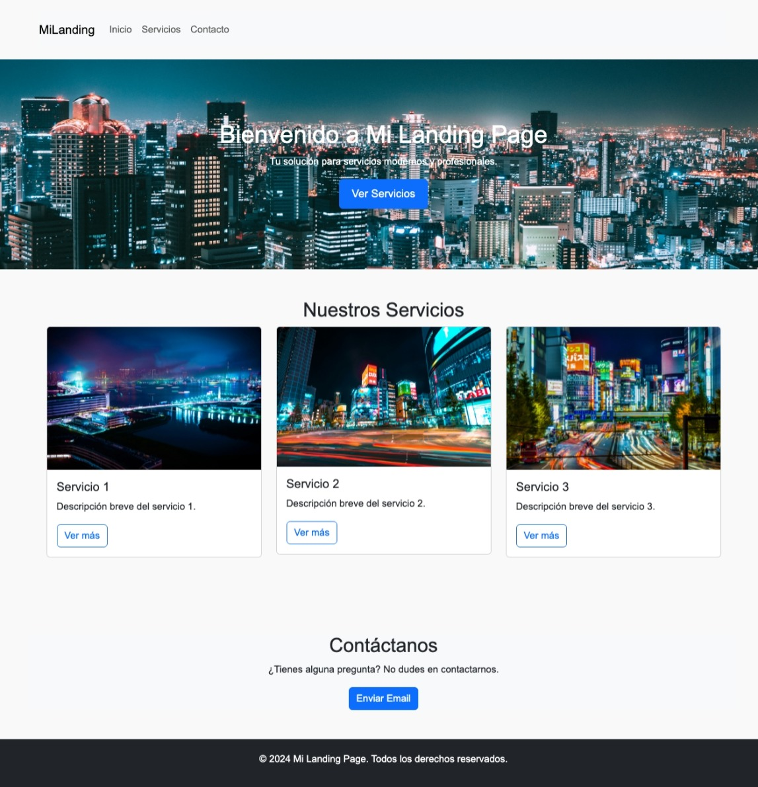

# Landing Page Modular con Bootstrap

Este es un proyecto de **landing page modular** desarrollado utilizando **Bootstrap** para la creación de un diseño responsivo y limpio. El proyecto se organiza aplicando **buenas prácticas de modularización de estilos**, lo que asegura que los archivos CSS sean escalables y fáciles de mantener. Además, se utiliza la **metodología BEM** para nombrar y organizar las clases CSS de manera estructurada y coherente.

## Descripción

La **landing page** está diseñada con un enfoque modular para facilitar su escalabilidad. Bootstrap proporciona la base para el diseño responsivo y facilita el uso de componentes predefinidos, como botones, tarjetas y grillas. La estructura del proyecto está cuidadosamente organizada en múltiples archivos CSS para separar los estilos básicos, del layout y los componentes reutilizables, lo que permite una fácil personalización y mantenimiento.

### Características principales:

- **Bootstrap** para diseño responsivo y componentes predefinidos.
- **Modularización de estilos** en archivos separados (`base.css`, `layout.css`, `components.css`, etc.).
- **Metodología BEM** para la organización de clases CSS.
- Diseño limpio y responsivo adaptado a dispositivos móviles y de escritorio.

## Visuales

### Vista inicial (Inicio)



## Empezando 🚀

A continuación, se explica cómo configurar y ejecutar este proyecto en tu máquina local.

### Prerrequisitos 📋

Para ejecutar el proyecto en tu entorno local, necesitarás:

- Un navegador moderno (por ejemplo, Google Chrome, Firefox, Edge)
- Editor de texto (Visual Studio Code recomendado)

### Instalación 🔧

1. **Clona este repositorio en tu máquina local**:

   ```bash
   git clone https://github.com/adalid-cl/ESPECIALIZACION_FRONTEND_M2_AE3.git
   ```

2. **Navega hasta el directorio del proyecto**:

   ```bash
   cd ESPECIALIZACION_FRONTEND_M2_AE3
   ```

3. **Abre el archivo `index.html` en tu navegador**:

   Solo necesitas abrir el archivo `index.html` en un navegador para ver el proyecto en funcionamiento.

## Estructura del Proyecto

```bash
/landing-page-bootstrap
├── index.html             # Página principal
├── /css
│   ├── base.css           # Estilos básicos y reset
│   ├── layout.css         # Estilos relacionados al layout (header, footer, grid)
│   ├── components.css     # Estilos de componentes (botones, tarjetas, etc.)
│   └── utilities.css      # Utilidades CSS personalizadas
├── /js
│   └── script.js          # Scripts de la página (si es necesario)
├── /images                # Carpeta de imágenes
└── README.md              # Archivo README para describir el proyecto
```

## Construido Con 🛠️

Este proyecto fue construido utilizando las siguientes tecnologías:

- **HTML5** - Para estructurar el contenido de la página.
- **CSS3** - Para el diseño y modularización de los estilos.
- **Bootstrap 4** - Para el diseño responsivo y los componentes predefinidos.
- **JavaScript** - Para la interacción con Bootstrap y la lógica personalizada.
- **Metodología BEM** - Para la organización y modularización de los nombres de clases CSS.

## Ejecutando las Pruebas ⚙️

Este proyecto no incluye un conjunto de pruebas automatizadas, pero puedes verificar su correcto funcionamiento abriendo el archivo `index.html` y navegando por la página.

### Pruebas de Principio a Fin 🔩

Puedes comprobar si el proyecto es completamente funcional probando:

- Navegar entre las secciones "Inicio", "Servicios", y "Contacto" sin problemas de visualización o comportamiento.
- Revisar que el diseño responda correctamente al cambiar el tamaño de la ventana del navegador.

## Despliegue 📦

Este proyecto se puede desplegar en cualquier servidor estático o servicio de alojamiento web como GitHub Pages, Netlify, o Vercel.

### Despliegue en GitHub Pages:

1. **Sube los archivos del proyecto a un repositorio en GitHub.**
2. **Activa GitHub Pages desde la configuración del repositorio.**
3. **Selecciona la rama donde está tu `index.html` (normalmente `main` o `master`).**
4. **Accede al proyecto usando el enlace proporcionado por GitHub Pages.**

## Contribuyendo 🖇️

Si deseas contribuir a este proyecto, puedes hacerlo abriendo un pull request en el repositorio de GitHub.

## Soporte

Si encuentras algún problema o tienes sugerencias, por favor abre un issue en el repositorio: [Issues](https://github.com/adalid-cl/ESPECIALIZACION_FRONTEND_M2_AE3/issues).

## Roadmap

### Mejoras futuras:

- Añadir más secciones, como "Testimonios" o "Sobre Nosotros".
- Implementar un formulario de contacto funcional con validación en JavaScript.
- Optimización de imágenes y uso de Lazy Loading para mejorar la performance.

## Versionado 📌

Usamos Git para el versionado. Para las versiones disponibles, ve las [etiquetas en este repositorio](https://github.com/adalid-cl/ESPECIALIZACION_FRONTEND_M2_AE3/tags).

## Autores ✒️

- **Brayan Diaz C** - _Trabajo inicial_ - [Brayan Diaz C](https://github.com/brayandiazc)

Mira también la lista de [contribuidores](https://github.com/adalid-cl/ESPECIALIZACION_FRONTEND_M2_AE3/contributors) que han participado en este proyecto.

## Licencia 📄

Este proyecto está bajo la Licencia MIT - ve el archivo [LICENSE.md](LICENSE.md) para detalles.

## Expresiones de Gratitud 🎁

- Comparte este proyecto con otros desarrolladores.
- Siéntete libre de iniciar un nuevo issue o enviar un pull request para contribuir.
- Invítame un café ☕ si encuentras útil este proyecto.

---

## Consejos Adicionales 📝

- Mantén los archivos CSS bien organizados para facilitar el mantenimiento y la escalabilidad.
- Aprovecha Bootstrap para crear componentes consistentes y responsivos de manera rápida.

---

⌨️ con ❤️ por [Adalid CL](https://github.com/adalid-cl) 😊
